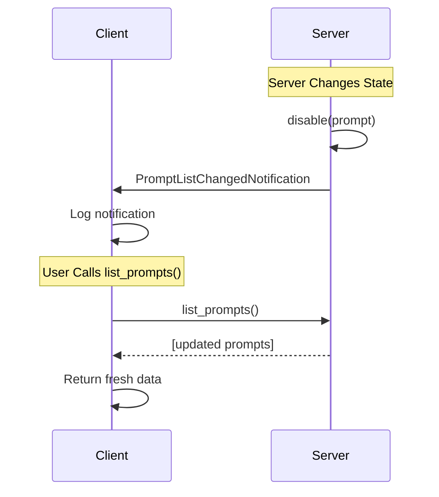

# Prompts

Prompts in MCP are reusable templates for structured interactions between AI models and servers. They provide predefined interaction patterns with parameters, enabling consistent and efficient communication for common use cases.

## What are Prompts?

Prompts are interaction templates with:
- **User-controlled invocation** requiring explicit activation
- **Parameter definitions** for customizable inputs
- **Structured formats** for consistent interactions
- **Context-aware content** that can adapt to different scenarios

Common examples include:
- Task planning templates ("Plan a vacation")
- Code review workflows ("Review this pull request")
- Content generation patterns ("Write a blog post about...")
- Analysis frameworks ("Analyze market trends for...")
- Decision support templates ("Compare options for...")

## Characteristics of Prompts

### User Control
Prompts are never invoked automatically - they require explicit user activation, ensuring transparency and control over AI interactions.

### Parameter Support
Prompts can accept parameters to customize their behavior and adapt to specific contexts.

### Reusability
Well-designed prompts can be reused across different contexts and conversations.

## Listing Available Prompts

To see what prompts are available from a connected MCP server:

<CodeGroup>
```typescript TypeScript
import { MCPClient } from 'mcp-use'

async function listPrompts() {
    // Initialize client with server configuration
    const config = {
        mcpServers: {
            // Your server definitions here
        }
    }
    const client = new MCPClient(config)

    // Connect to servers
    await client.createAllSessions()

    // Get a session for a specific server
    const session = client.getSession('my_server')

    // List all available prompts - always returns fresh data
    const prompts = await session.listPrompts()

    for (const prompt of prompts) {
        console.log(`Prompt: ${prompt.name}`)
        console.log(`Description: ${prompt.description}`)
        if (prompt.arguments) {
            console.log('Arguments:')
            for (const arg of prompt.arguments) {
                console.log(`  - ${arg.name}: ${arg.description}`)
            }
        }
        console.log('---')
    }

    await client.closeAllSessions()
}

// Run the example
listPrompts().catch(console.error)
```

```typescript TypeScript
import { MCPClient } from 'mcp-use'

async function listPrompts() {
    // Initialize client with server configuration
    const config = {
        mcpServers: {
            // Your server definitions here
        }
    }
    const client = new MCPClient(config)

    // Connect to servers
    await client.createAllSessions()

    // Get a session for a specific server
    const session = client.getSession('my_server')

    // List all available prompts - always returns fresh data
    const prompts = await session.listPrompts()

    for prompt in prompts:
        print(f"Prompt: {prompt.name}")
        print(f"Description: {prompt.description}")
        if prompt.arguments:
            print("Arguments:")
            for arg in prompt.arguments:
                print(f"  - {arg.name}: {arg.description}")
        print("---")

<<<<<<< HEAD
# Run the example
asyncio.run(list_prompts())
=======
```typescript TypeScript
import { MCPClient } from 'mcp-use'

async function listPrompts() {
    // Initialize client with server configuration
    const config = {
        mcpServers: {
            // Your server definitions here
        }
    }
    const client = new MCPClient(config)

    // Connect to servers
    await client.createAllSessions()

    // Get a session for a specific server
    const session = client.getSession('my_server')

    // List all available prompts - always returns fresh data
    const prompts = await session.listPrompts()

    for (const prompt of prompts) {
        console.log(`Prompt: ${prompt.name}`)
        console.log(`Description: ${prompt.description}`)
        if (prompt.arguments) {
            console.log('Arguments:')
            for (const arg of prompt.arguments) {
                console.log(`  - ${arg.name}: ${arg.description}`)
            }
        }
        console.log('---')
    }

    await client.closeAllSessions()
}

// Run the example
listPrompts().catch(console.error)
```

```typescript TypeScript
import { MCPClient } from 'mcp-use'

async function listPrompts() {
    // Initialize client with server configuration
    const config = {
        mcpServers: {
            // Your server definitions here
        }
    }
    const client = new MCPClient(config)

    // Connect to servers
    await client.createAllSessions()

    // Get a session for a specific server
    const session = client.getSession('my_server')

    // List all available prompts - always returns fresh data
    const prompts = await session.listPrompts()

    for (const prompt of prompts) {
        console.log(`Prompt: ${prompt.name}`)
        console.log(`Description: ${prompt.description}`)
        if (prompt.arguments) {
            console.log('Arguments:')
            for (const arg of prompt.arguments) {
                console.log(`  - ${arg.name}: ${arg.description}`)
            }
        }
        console.log('---')
    }

    await client.closeAllSessions()
}

// Run the example
listPrompts().catch(console.error)
>>>>>>> 8f43938 (move docs)
```
=======

# Run the example
asyncio.run(list_prompts())
```

```typescript TypeScript
import { MCPClient } from 'mcp-use'

async function listPrompts() {
    // Initialize client with server configuration
    const config = {
        mcpServers: {
            // Your server definitions here
        }
    }
    const client = new MCPClient(config)

    // Connect to servers
    await client.createAllSessions()

    // Get a session for a specific server
    const session = client.getSession('my_server')

    // List all available prompts - always returns fresh data
    const prompts = await session.listPrompts()

    for (const prompt of prompts) {
        console.log(`Prompt: ${prompt.name}`)
        console.log(`Description: ${prompt.description}`)
        if (prompt.arguments) {
            console.log('Arguments:')
            for (const arg of prompt.arguments) {
                console.log(`  - ${arg.name}: ${arg.description}`)
            }
        }
        console.log('---')
    }

    await client.closeAllSessions()
}

// Run the example
listPrompts().catch(console.error)
```
>>>>>>> 3ff31be (move docs)
</CodeGroup>

### Automatic Prompt List Update

When servers send `PromptListChangedNotification`, it signals that the prompt list has changed. The `list_prompts()` method always fetches fresh data from the server, ensuring you get up-to-date information.



**Important:** Always use `await session.list_prompts()` instead of the deprecated `session.prompts` property to ensure you get fresh data:

<CodeGroup>
```typescript TypeScript
// ✅ Recommended - always returns fresh data
const prompts = await session.listPrompts()

// ⚠️ Deprecated - may return stale data
// const prompts = session.prompts
```

```typescript TypeScript
// ✅ Recommended - always returns fresh data
const prompts = await session.listPrompts()

# ⚠️ Deprecated - may return stale data
# prompts = session.prompts
=======
```typescript TypeScript
// ✅ Recommended - always returns fresh data
const prompts = await session.listPrompts()

// ⚠️ Deprecated - may return stale data
// const prompts = session.prompts
```

```typescript TypeScript
// ✅ Recommended - always returns fresh data
const prompts = await session.listPrompts()

// ⚠️ Deprecated - may return stale data
// const prompts = session.prompts
>>>>>>> 8f43938 (move docs)
```
<<<<<<< HEAD
=======

```typescript TypeScript
// ✅ Recommended - always returns fresh data
const prompts = await session.listPrompts()

// ⚠️ Deprecated - may return stale data
// const prompts = session.prompts
```
>>>>>>> 3ff31be (move docs)
</CodeGroup>

## Getting and Using Prompts

Prompts are retrieved using the `get_prompt` method:

<CodeGroup>
```typescript TypeScript
import { MCPClient } from 'mcp-use'

async function usePromptExample() {
    const config = {
        mcpServers: {
            // Your server definitions here
        }
    }
    const client = new MCPClient(config)
    await client.createAllSessions()

    const session = client.getSession('planning_server')

    // Get a prompt with arguments
    const result = await session.getPrompt(
        'plan_vacation',
        {
            destination: 'Japan',
            duration: '2 weeks',
            budget: '$5000',
            interests: ['culture', 'food', 'nature']
        }
    )

    // Use the prompt content
    console.log(`Prompt description: ${result.description}`)
    for (const message of result.messages) {
        console.log(`Role: ${message.role}`)
        console.log(`Content: ${message.content.text}`)
    }

    await client.closeAllSessions()
}

usePromptExample().catch(console.error)
```

```typescript TypeScript
import { MCPClient } from 'mcp-use'

async function usePromptExample() {
    const config = {
        mcpServers: {
            // Your server definitions here
        }
    }
    const client = new MCPClient(config)
    await client.createAllSessions()

    const session = client.getSession('planning_server')

    // Get a prompt with arguments
    const result = await session.getPrompt(
        'plan_vacation',
        {
            destination: 'Japan',
            duration: '2 weeks',
            budget: '$5000',
            interests: ['culture', 'food', 'nature']
        }
    )

    # Use the prompt content
    print(f"Prompt description: {result.description}")
    for message in result.messages:
        print(f"Role: {message.role}")
        print(f"Content: {message.content.text}")

<<<<<<< HEAD
asyncio.run(use_prompt_example())
=======
```typescript TypeScript
import { MCPClient } from 'mcp-use'

async function usePromptExample() {
    const config = {
        mcpServers: {
            // Your server definitions here
        }
    }
    const client = new MCPClient(config)
    await client.createAllSessions()

    const session = client.getSession('planning_server')

    // Get a prompt with arguments
    const result = await session.getPrompt(
        'plan_vacation',
        {
            destination: 'Japan',
            duration: '2 weeks',
            budget: '$5000',
            interests: ['culture', 'food', 'nature']
        }
    )

    // Use the prompt content
    console.log(`Prompt description: ${result.description}`)
    for (const message of result.messages) {
        console.log(`Role: ${message.role}`)
        console.log(`Content: ${message.content.text}`)
    }

    await client.closeAllSessions()
}

usePromptExample().catch(console.error)
```

```typescript TypeScript
import { MCPClient } from 'mcp-use'

async function usePromptExample() {
    const config = {
        mcpServers: {
            // Your server definitions here
        }
    }
    const client = new MCPClient(config)
    await client.createAllSessions()

    const session = client.getSession('planning_server')

    // Get a prompt with arguments
    const result = await session.getPrompt(
        'plan_vacation',
        {
            destination: 'Japan',
            duration: '2 weeks',
            budget: '$5000',
            interests: ['culture', 'food', 'nature']
        }
    )

    // Use the prompt content
    console.log(`Prompt description: ${result.description}`)
    for (const message of result.messages) {
        console.log(`Role: ${message.role}`)
        console.log(`Content: ${message.content.text}`)
    }

    await client.closeAllSessions()
}

usePromptExample().catch(console.error)
>>>>>>> 8f43938 (move docs)
```
=======

asyncio.run(use_prompt_example())
```

```typescript TypeScript
import { MCPClient } from 'mcp-use'

async function usePromptExample() {
    const config = {
        mcpServers: {
            // Your server definitions here
        }
    }
    const client = new MCPClient(config)
    await client.createAllSessions()

    const session = client.getSession('planning_server')

    // Get a prompt with arguments
    const result = await session.getPrompt(
        'plan_vacation',
        {
            destination: 'Japan',
            duration: '2 weeks',
            budget: '$5000',
            interests: ['culture', 'food', 'nature']
        }
    )

    // Use the prompt content
    console.log(`Prompt description: ${result.description}`)
    for (const message of result.messages) {
        console.log(`Role: ${message.role}`)
        console.log(`Content: ${message.content.text}`)
    }

    await client.closeAllSessions()
}

usePromptExample().catch(console.error)
```
>>>>>>> 3ff31be (move docs)
</CodeGroup>

## Prompt Without Arguments

Some prompts don't require parameters:

<CodeGroup>
```typescript TypeScript
async function simplePromptExample() {
    const config = {
        mcpServers: {
            // Your server definitions here
        }
    }
    const client = new MCPClient(config)
    await client.createAllSessions()

    const session = client.getSession('content_server')

    // Get a prompt without arguments
    const result = await session.getPrompt('writing_tips')

    // Display the prompt content
    for (const message of result.messages) {
        console.log(`${message.role}: ${message.content.text}`)
    }

    await client.closeAllSessions()
}

simplePromptExample().catch(console.error)
```

```typescript TypeScript
async function simplePromptExample() {
    const config = {
        mcpServers: {
            // Your server definitions here
        }
    }
    const client = new MCPClient(config)
    await client.createAllSessions()

    const session = client.getSession('content_server')

    // Get a prompt without arguments
    const result = await session.getPrompt('writing_tips')

    # Display the prompt content
    for message in result.messages:
        print(f"{message.role}: {message.content.text}")

<<<<<<< HEAD
asyncio.run(simple_prompt_example())
=======
```typescript TypeScript
async function simplePromptExample() {
    const config = {
        mcpServers: {
            // Your server definitions here
        }
    }
    const client = new MCPClient(config)
    await client.createAllSessions()

    const session = client.getSession('content_server')

    // Get a prompt without arguments
    const result = await session.getPrompt('writing_tips')

    // Display the prompt content
    for (const message of result.messages) {
        console.log(`${message.role}: ${message.content.text}`)
    }

    await client.closeAllSessions()
}

simplePromptExample().catch(console.error)
```

```typescript TypeScript
async function simplePromptExample() {
    const config = {
        mcpServers: {
            // Your server definitions here
        }
    }
    const client = new MCPClient(config)
    await client.createAllSessions()

    const session = client.getSession('content_server')

    // Get a prompt without arguments
    const result = await session.getPrompt('writing_tips')

    // Display the prompt content
    for (const message of result.messages) {
        console.log(`${message.role}: ${message.content.text}`)
    }

    await client.closeAllSessions()
}

simplePromptExample().catch(console.error)
>>>>>>> 8f43938 (move docs)
```
=======

asyncio.run(simple_prompt_example())
```

```typescript TypeScript
async function simplePromptExample() {
    const config = {
        mcpServers: {
            // Your server definitions here
        }
    }
    const client = new MCPClient(config)
    await client.createAllSessions()

    const session = client.getSession('content_server')

    // Get a prompt without arguments
    const result = await session.getPrompt('writing_tips')

    // Display the prompt content
    for (const message of result.messages) {
        console.log(`${message.role}: ${message.content.text}`)
    }

    await client.closeAllSessions()
}

simplePromptExample().catch(console.error)
```
>>>>>>> 3ff31be (move docs)
</CodeGroup>

## Prompt Structure

Prompts return structured content with messages:

<CodeGroup>
<<<<<<< HEAD
```python Python
# Example of working with prompt results
result = await session.get_prompt("code_review", {"language": "python"})

for message in result.messages:
    # Messages have roles (e.g., "user", "assistant", "system")
    role = message.role

    # Content can be text or other formats
    if hasattr(message.content, 'text'):
        text_content = message.content.text
        print(f"{role}: {text_content}")

    # Handle other content types if needed
    if hasattr(message.content, 'image'):
        print(f"{role}: [Image content]")
=======
```typescript TypeScript
// Example of working with prompt results
const result = await session.getPrompt('code_review', { language: 'python' })

for (const message of result.messages) {
    // Messages have roles (e.g., "user", "assistant", "system")
    const role = message.role

    // Content can be text or other formats
    if ('text' in message.content) {
        const textContent = message.content.text
        console.log(`${role}: ${textContent}`)
    }

    // Handle other content types if needed
    if ('image' in message.content) {
        console.log(`${role}: [Image content]`)
    }
}
```

```typescript TypeScript
// Example of working with prompt results
const result = await session.getPrompt('code_review', { language: 'python' })

for (const message of result.messages) {
    // Messages have roles (e.g., "user", "assistant", "system")
    const role = message.role

    // Content can be text or other formats
    if ('text' in message.content) {
        const textContent = message.content.text
        console.log(`${role}: ${textContent}`)
    }

    // Handle other content types if needed
    if ('image' in message.content) {
        console.log(`${role}: [Image content]`)
    }
}
>>>>>>> 8f43938 (move docs)
```
<<<<<<< HEAD
=======

```typescript TypeScript
// Example of working with prompt results
const result = await session.getPrompt('code_review', { language: 'python' })

for (const message of result.messages) {
    // Messages have roles (e.g., "user", "assistant", "system")
    const role = message.role

    // Content can be text or other formats
    if ('text' in message.content) {
        const textContent = message.content.text
        console.log(`${role}: ${textContent}`)
    }

    // Handle other content types if needed
    if ('image' in message.content) {
        console.log(`${role}: [Image content]`)
    }
}
```
>>>>>>> 3ff31be (move docs)
</CodeGroup>

## Parameter Completion

Many prompts support parameter completion to help users understand required inputs:

<CodeGroup>
<<<<<<< HEAD
```python Python
async def explore_prompt_parameters():
    session = client.get_session("my_server")
    prompts = await session.list_prompts()

    for prompt in prompts:
        print(f"Prompt: {prompt.name}")
        if prompt.arguments:
            print("Required parameters:")
            for arg in prompt.arguments:
                required = "required" if arg.required else "optional"
                print(f"  - {arg.name} ({required}): {arg.description}")
        print()
=======
```typescript TypeScript
async function explorePromptParameters() {
    const session = client.getSession('my_server')
    const prompts = await session.listPrompts()

    for (const prompt of prompts) {
        console.log(`Prompt: ${prompt.name}`)
        if (prompt.arguments) {
            console.log('Required parameters:')
            for (const arg of prompt.arguments) {
                const required = arg.required ? 'required' : 'optional'
                console.log(`  - ${arg.name} (${required}): ${arg.description}`)
            }
        }
        console.log()
    }
}
```

```typescript TypeScript
async function explorePromptParameters() {
    const session = client.getSession('my_server')
    const prompts = await session.listPrompts()

    for (const prompt of prompts) {
        console.log(`Prompt: ${prompt.name}`)
        if (prompt.arguments) {
            console.log('Required parameters:')
            for (const arg of prompt.arguments) {
                const required = arg.required ? 'required' : 'optional'
                console.log(`  - ${arg.name} (${required}): ${arg.description}`)
            }
        }
        console.log()
    }
}
>>>>>>> 8f43938 (move docs)
```
<<<<<<< HEAD
=======

```typescript TypeScript
async function explorePromptParameters() {
    const session = client.getSession('my_server')
    const prompts = await session.listPrompts()

    for (const prompt of prompts) {
        console.log(`Prompt: ${prompt.name}`)
        if (prompt.arguments) {
            console.log('Required parameters:')
            for (const arg of prompt.arguments) {
                const required = arg.required ? 'required' : 'optional'
                console.log(`  - ${arg.name} (${required}): ${arg.description}`)
            }
        }
        console.log()
    }
}
```
>>>>>>> 3ff31be (move docs)
</CodeGroup>

## Dynamic Prompt Generation

Some prompts can generate different content based on context:

<CodeGroup>
<<<<<<< HEAD
```python Python
async def dynamic_prompt_example():
    config = {
        "mcpServers": {
            # Your server definitions here
        }
    }
    const client = new MCPClient(config)
    await client.createAllSessions()

    const session = client.getSession('adaptive_server')

    // Same prompt with different parameters
    const contexts = [
        { domain: 'healthcare', complexity: 'beginner' },
        { domain: 'finance', complexity: 'expert' }
    ]

    for context in contexts:
        result = await session.get_prompt("domain_analysis", context)
        print(f"Analysis for {context['domain']}:")
        for message in result.messages:
            print(f"  {message.content.text[:100]}...")
        print()
=======
```typescript TypeScript
async function dynamicPromptExample() {
    const config = {
        mcpServers: {
            // Your server definitions here
        }
    }
    const client = new MCPClient(config)
    await client.createAllSessions()

    const session = client.getSession('adaptive_server')

    // Same prompt with different parameters
    const contexts = [
        { domain: 'healthcare', complexity: 'beginner' },
        { domain: 'finance', complexity: 'expert' }
    ]

    for (const context of contexts) {
        const result = await session.getPrompt('domain_analysis', context)
        console.log(`Analysis for ${context.domain}:`)
        for (const message of result.messages) {
            console.log(`  ${message.content.text.substring(0, 100)}...`)
        }
        console.log()
    }

    await client.closeAllSessions()
}
```

```typescript TypeScript
async function dynamicPromptExample() {
    const config = {
        mcpServers: {
            // Your server definitions here
        }
    }
    const client = new MCPClient(config)
    await client.createAllSessions()

    const session = client.getSession('adaptive_server')

    // Same prompt with different parameters
    const contexts = [
        { domain: 'healthcare', complexity: 'beginner' },
        { domain: 'finance', complexity: 'expert' }
    ]

    for (const context of contexts) {
        const result = await session.getPrompt('domain_analysis', context)
        console.log(`Analysis for ${context.domain}:`)
        for (const message of result.messages) {
            console.log(`  ${message.content.text.substring(0, 100)}...`)
        }
        console.log()
    }

    await client.closeAllSessions()
}
>>>>>>> 8f43938 (move docs)
```
<<<<<<< HEAD
=======

```typescript TypeScript
async function dynamicPromptExample() {
    const config = {
        mcpServers: {
            // Your server definitions here
        }
    }
    const client = new MCPClient(config)
    await client.createAllSessions()

    const session = client.getSession('adaptive_server')

    // Same prompt with different parameters
    const contexts = [
        { domain: 'healthcare', complexity: 'beginner' },
        { domain: 'finance', complexity: 'expert' }
    ]

    for (const context of contexts) {
        const result = await session.getPrompt('domain_analysis', context)
        console.log(`Analysis for ${context.domain}:`)
        for (const message of result.messages) {
            console.log(`  ${message.content.text.substring(0, 100)}...`)
        }
        console.log()
    }

    await client.closeAllSessions()
}
```
>>>>>>> 3ff31be (move docs)
</CodeGroup>

## Error Handling

Handle potential errors when working with prompts:

<CodeGroup>
<<<<<<< HEAD
```python Python
try:
    result = await session.get_prompt("missing_prompt", {"param": "value"})
    for message in result.messages:
        print(message.content.text)
except Exception as e:
    print(f"Failed to get prompt: {e}")

# Check if prompt exists before using
available_prompts = await session.list_prompts()
prompt_names = [p.name for p in available_prompts]

if "my_prompt" in prompt_names:
    result = await session.get_prompt("my_prompt")
else:
    print("Prompt not available")
=======
```typescript TypeScript
try {
    const result = await session.getPrompt('missing_prompt', { param: 'value' })
    for (const message of result.messages) {
        console.log(message.content.text)
    }
} catch (error) {
    console.error(`Failed to get prompt: ${error}`)
}

// Check if prompt exists before using
const availablePrompts = await session.listPrompts()
const promptNames = availablePrompts.map(p => p.name)

if (promptNames.includes('my_prompt')) {
    const result = await session.getPrompt('my_prompt')
} else {
    console.log('Prompt not available')
}
```

```typescript TypeScript
try {
    const result = await session.getPrompt('missing_prompt', { param: 'value' })
    for (const message of result.messages) {
        console.log(message.content.text)
    }
} catch (error) {
    console.error(`Failed to get prompt: ${error}`)
}

// Check if prompt exists before using
const availablePrompts = await session.listPrompts()
const promptNames = availablePrompts.map(p => p.name)

if (promptNames.includes('my_prompt')) {
    const result = await session.getPrompt('my_prompt')
} else {
    console.log('Prompt not available')
}
>>>>>>> 8f43938 (move docs)
```
<<<<<<< HEAD
=======

```typescript TypeScript
try {
    const result = await session.getPrompt('missing_prompt', { param: 'value' })
    for (const message of result.messages) {
        console.log(message.content.text)
    }
} catch (error) {
    console.error(`Failed to get prompt: ${error}`)
}

// Check if prompt exists before using
const availablePrompts = await session.listPrompts()
const promptNames = availablePrompts.map(p => p.name)

if (promptNames.includes('my_prompt')) {
    const result = await session.getPrompt('my_prompt')
} else {
    console.log('Prompt not available')
}
```
>>>>>>> 3ff31be (move docs)
</CodeGroup>
