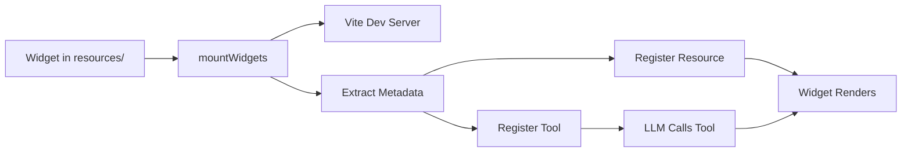

# UI Widgets

UI widgets allow you to create rich, interactive user interfaces that MCP clients can display.
The framework supports multiple widget formats including **MCP-UI** and **OpenAI Apps SDK** components.


# Automatic Widget Registration

The `mcp-use` framework automatically registers all React components in your `resources/` folder as MCP tools and resources, eliminating the need for manual configuration and boilerplate code. This powerful feature allows you to focus on building UI components while the framework handles the MCP integration.

## Overview

When you create a React component in the `resources/` folder with proper metadata, `mcp-use` automatically:

- **Registers an MCP Tool** - LLMs can invoke it with parameters
- **Registers an MCP Resource** - Clients can discover and access it
- **Extracts Input Schema** - Tool parameters are derived from component props
- **Serves with HMR** - Hot Module Replacement for rapid development
- **Builds for Production** - Optimized Apps SDK widgets
- **Handles Props Mapping** - From LLM → Tool arguments → Apps SDK → React component

**No manual registration required!** Just create a widget file, export metadata, and the mcp-use SDK does the rest.

## Quick Start

### 1. Create a Project

Start with the Apps SDK template which includes automatic widget registration:

```bash
npx create-mcp-use-app my-mcp-server --template apps-sdk
cd my-mcp-server
npm run dev
```

This creates a project with:
```
my-mcp-server/
├── resources/              # 👈 Put your UI widgets here
│   └── display-weather.tsx # Example widget
├── index.ts               # Server entry point
└── package.json
```

### 2. Create a Widget

Add a new file in `resources/`, for example `resources/user-card.tsx`:

```tsx
import React from 'react';
import { z } from 'zod';
import { useWidget } from 'mcp-use/react';

// Define the props schema
const propSchema = z.object({
  name: z.string().describe('User full name'),
  email: z.string().email().describe('User email address'),
  avatar: z.string().url().optional().describe('Avatar image URL'),
  role: z.enum(['admin', 'user', 'guest']).describe('User role'),
});

// Export metadata for automatic registration
export const widgetMetadata = {
  description: 'Display a user profile card',
  inputs: propSchema,
};

type UserCardProps = z.infer<typeof propSchema>;

const UserCard: React.FC = () => {
  // useWidget hook provides props from Apps SDK or MCP-UI
  const { props, theme } = useWidget<UserCardProps>();

  const { name, email, avatar, role } = props;

// Export metadata for automatic registration
export const widgetMetadata = {
  description: 'Display a user profile card',
  inputs: propSchema,
};

type UserCardProps = z.infer<typeof propSchema>;

const UserCard: React.FC = () => {
  // useWidget hook provides props from Apps SDK or MCP-UI
  const { props, theme } = useWidget<UserCardProps>();

  const { name, email, avatar, role } = props;

// Export metadata for automatic registration
export const widgetMetadata = {
  description: 'Display a user profile card',
  inputs: propSchema,
};

type UserCardProps = z.infer<typeof propSchema>;

const UserCard: React.FC = () => {
  // useWidget hook provides props from Apps SDK or MCP-UI
  const { props, theme } = useWidget<UserCardProps>();

  const { name, email, avatar, role } = props;

  return (
    <div className={`p-6 rounded-lg shadow-lg ${theme === 'dark' ? 'bg-gray-800 text-white' : 'bg-white text-gray-900'}`}>
      {avatar && (
        
      )}
      <h2 className="text-2xl font-bold text-center mb-2">{name}</h2>
      <p className="text-center text-gray-500 mb-2">{email}</p>
      <span className="inline-block px-3 py-1 rounded-full text-sm bg-blue-500 text-white">
        {role}
      </span>
    </div>
  );
};

export default UserCard;
```

### 3. That's It!

The widget is automatically:
- **Registered as tool**: `user-card`
- **Available as resource**: `ui://widget/user-card.html`
- **Ready in ChatGPT**: LLM can call it with name, email, avatar, role

No manual `server.tool()` or `server.uiResource()` calls needed!

## How It Works

### The Flow



### 1. Widget Discovery

When you call `server.listen()`, the framework automatically calls `mountWidgets()` which:

- Scans the `resources/` directory for `.tsx` and `.ts` files
- Creates a Vite dev server for each widget with HMR support
- Loads widget metadata using Vite SSR

### 2. Metadata Extraction

The framework looks for the `widgetMetadata` export in each widget file:

```typescript
export const widgetMetadata = {
  description: 'Display weather for a city',
  inputs: propSchema,  // Zod schema for props
}
```

The `inputs` Zod schema defines:
- **What props the component needs**
- **What parameters the tool accepts**
- **Type validation and descriptions for the LLM**

### 3. Tool Registration

The framework automatically registers a tool with:
- **Name**: Derived from filename (e.g., `display-weather.tsx` → `display-weather`)
- **Description**: From `widgetMetadata.description`
- **Inputs**: Converted from Zod schema to MCP input definitions
- **Callback**: Returns the widget resource with a unique URI

### 4. Resource Registration

The framework registers both:
- **Static Resource**: `ui://widget/{name}.html` - Base resource
- **Dynamic Template**: `ui://widget/{name}-{id}.html` - Unique per invocation

Each resource includes:
- **HTML Template**: With proper script tags and styles
- **Apps SDK Metadata**: CSP configuration, widget description, etc.
- **MIME Type**: `text/html+skybridge` for Apps SDK compatibility

### 5. Props Flow

When an LLM invokes the tool:

1. **LLM** fills tool parameters based on context and inputs schema
2. **MCP Server** returns widget resource URI + `structuredContent` with params
3. **Apps SDK** (ChatGPT) loads the widget HTML
4. **Apps SDK** injects params as `window.openai.toolInput`
5. **useWidget Hook** reads from `window.openai` and provides props to React component
6. **React Component** renders with the props


## Widget Metadata

### widgetMetadata Object
Contains the information that the MCP resource (and the tool that exposes it) will use when are automatically built by mcp-use.
```typescript
export const widgetMetadata = {
  // Required: Human-readable description
  description: string,
  // Required: Zod schema defining component props
  inputs: z.ZodObject<...>,
}
```

### Raw HTML Widgets

Inline HTML content:

```typescript
const propSchema = z.object({
  // Basic types
  name: z.string().describe('User name'),
  age: z.number().min(0).max(150).describe('User age'),
  active: z.boolean().describe('Is user active'),

  // Enums for specific choices
  status: z.enum(['pending', 'approved', 'rejected']).describe('Request status'),

  // Optional fields
  email: z.string().email().optional().describe('Optional email address'),

  // Arrays
  tags: z.array(z.string()).describe('List of tags'),

  // Nested objects
  address: z.object({
    street: z.string(),
    city: z.string(),
    zip: z.string(),
  }).describe('User address'),
});
```

## The useWidget Hook

The `useWidget` hook is the bridge between Apps SDK and React:

```typescript
import { useWidget } from 'mcp-use/react';

const MyWidget: React.FC = () => {
  const {
    // Props from LLM/tool invocation
    props,              // Typed props based on your schema
    output,             // Tool output data (if any)
    metadata,           // Response metadata
    state,              // Persistent widget state
    setState,           // Update widget state
    // Layout & theme
    theme,              // 'light' | 'dark'
    displayMode,        // 'inline' | 'fullscreen' | 'popup'
    safeArea,           // Safe area insets
    maxHeight,          // Max widget height
    userAgent,          // Device capabilities
    locale,             // User locale
    // Actions
    callTool,           // Call other MCP tools
    sendFollowUpMessage,// Send message to chat
    openExternal,       // Open external URLs
    requestDisplayMode, // Request display mode change

    // Availability
    isAvailable,        // Is Apps SDK available
  } = useWidget<MyPropsType>();

  return <div>...</div>;
};
```

### OpenAI Apps SDK Widgets

ChatGPT-compatible widgets with Skybridge format:

```typescript
// ❌ Don't do this
const MyWidget: React.FC<MyProps> = ({ city, temperature }) => { ... }

// Do this
const MyWidget: React.FC = () => {
  const { props } = useWidget<MyProps>();
  const { city, temperature } = props;
  // ...
}
```

**2. Automatic Provider Detection**

The hook automatically detects whether it's running in:
- **Apps SDK** (ChatGPT): Reads from `window.openai`
- **MCP-UI**: Reads from URL parameters
- **Standalone**: Uses default props

**3. Theme Awareness**

```typescript
const { theme } = useWidget();
const bgColor = theme === 'dark' ? 'bg-gray-900' : 'bg-white';
```

**4. Interactive Capabilities**

```typescript
const { callTool, sendFollowUpMessage } = useWidget();

// Call another tool
const result = await callTool('search', { query: 'weather' });

// Send message to chat
await sendFollowUpMessage('Show me weather for New York');
```

## Complete Example: Weather Widget

Here's the complete `display-weather.tsx` from the template:

```tsx
import React from 'react';
import { z } from 'zod';
import { useWidget } from 'mcp-use/react';

// Define props schema
const propSchema = z.object({
  city: z.string().describe('The city to display weather for'),
  weather: z.enum(['sunny', 'rain', 'snow', 'cloudy']).describe('The weather condition'),
  temperature: z.number().min(-20).max(50).describe('The temperature in Celsius'),
});

// Export metadata for auto-registration
export const widgetMetadata = {
  description: 'Display weather for a city',
  inputs: propSchema,
}

type WeatherProps = z.infer<typeof propSchema>;

const WeatherWidget: React.FC = () => {
  const { props, theme } = useWidget<WeatherProps>();
  const { city, weather, temperature } = props;

  const getWeatherIcon = (weatherType: string) => {
    switch (weatherType?.toLowerCase()) {
      case 'sunny': return '☀️';
      case 'rain': return '🌧️';
      case 'snow': return '❄️';
      case 'cloudy': return '☁️';
      default: return '🌤️';
    }
  };

  const getWeatherColor = (weatherType: string) => {
    switch (weatherType?.toLowerCase()) {
      case 'sunny': return 'from-yellow-400 to-orange-500';
      case 'rain': return 'from-blue-400 to-blue-600';
      case 'snow': return 'from-blue-100 to-blue-300';
      case 'cloudy': return 'from-gray-400 to-gray-600';
      default: return 'from-gray-300 to-gray-500';
    }
  };

  const bgColor = theme === 'dark' ? 'bg-gray-900' : 'bg-white';
  const textColor = theme === 'dark' ? 'text-gray-100' : 'text-gray-800';

  return (
    <div className={`max-w-sm mx-auto ${bgColor} rounded-xl shadow-lg overflow-hidden`}>
      <div className={`h-32 bg-gradient-to-br ${getWeatherColor(weather)} flex items-center justify-center`}>
        <div className="text-6xl">{getWeatherIcon(weather)}</div>
      </div>
      <div className="p-6">
        <div className="text-center">
          <h2 className={`text-2xl font-bold ${textColor} mb-2`}>{city}</h2>
          <div className="flex items-center justify-center space-x-4">
            <span className={`text-4xl font-light ${textColor}`}>{temperature}°</span>
            <div className="text-right">
              <p className="text-lg font-medium capitalize">{weather}</p>
            </div>
          </div>
        </div>
      </div>
    </div>
  );
};

export default WeatherWidget;
```

### Testing in ChatGPT

Once your server is running, you can test in ChatGPT:

**User**: "Show me the weather in Paris. It's 22 degrees and sunny."

**ChatGPT** (behind the scenes):
1. Recognizes it should use `display-weather` tool
2. Fills parameters: `{ city: "Paris", weather: "sunny", temperature: 22 }`
3. Calls the tool
4. Receives widget resource URI
5. Loads and displays the widget

## Advanced Features

### Accessing Tool Output

Widgets can access the output of their own tool execution:

```typescript
server.uiResource({
  type: 'externalUrl',
  name: 'data_table',
  widget: 'data-table',
  title: 'Data Table',
  props: {
    // String property
    title: {
      type: 'string',
      description: 'Table title',
      required: false,
      default: 'Data Table'
    },

    // Number property
    pageSize: {
      type: 'number',
      description: 'Rows per page',
      required: false,
      default: 10
    },

    // Boolean property
    sortable: {
      type: 'boolean',
      description: 'Enable sorting',
      required: false,
      default: true
    },

    // Object property
    columns: {
      type: 'object',
      description: 'Column configuration',
      required: true
    },

    // Array property
    data: {
      type: 'array',
      description: 'Table data',
      required: true
    }
  }
})
```

## Accessing Widget Parameters

### In External URL Widgets

Parameters are passed as URL query parameters:

```typescript
const { callTool } = useWidget();

const handleSearch = async () => {
  const result = await callTool('search_cities', {
    query: 'tokyo'
  });
  console.log(result);
};
```

### In Apps SDK Widgets

Parameters are available via `window.openai.toolOutput`:

```javascript
// In your Apps SDK widget
const params = window.openai?.toolOutput || {};

// Access parameters directly
const { city, temperature, condition } = params;

// Use with fallbacks
const humidity = params.humidity || 50;
const windSpeed = params.windSpeed || 0;
```

## Advanced Widget Patterns

### Widget Communication

Enable parent-child communication:

```javascript
// In widget (child)
window.parent.postMessage({
  type: 'widget-event',
  event: 'data-updated',
  data: { /* ... */ }
}, '*');

// In parent (if supported by client)
window.addEventListener('message', (event) => {
  if (event.data.type === 'widget-event') {
    handleWidgetEvent(event.data);
  }
});
```

### Responsive Widgets

Create responsive layouts:

```html
<style>
  .container {
    width: 100%;
    max-width: 1200px;
    margin: 0 auto;
  }

  @media (max-width: 768px) {
    .grid { grid-template-columns: 1fr; }
  }

  @media (min-width: 769px) {
    .grid { grid-template-columns: repeat(3, 1fr); }
  }
</style>
```

### 3. Test in Inspector

1. Open `http://localhost:3000/inspector`
2. Navigate to Tools
3. Find `my-new-widget` tool (automatically registered!)
4. Test with parameters: `{ "title": "Hello" }`
5. See the widget render

### 4. Edit with Hot Reload

Edit your widget file and save. Changes appear instantly thanks to HMR!

### 5. Build for Production

```bash
npm run build
npm start
```

Builds optimized widget bundles for production deployment.

## Under the Hood

### Server Initialization

In your `index.ts`:

```typescript
import { createMCPServer } from 'mcp-use/server';

const server = createMCPServer('my-server', {
  version: '1.0.0',
  baseUrl: process.env.MCP_URL, // For Apps SDK CSP
});

// ... define manual tools/resources if needed ...

// This automatically calls mountWidgets() internally
await server.listen(3000);
```

### mountWidgets() Implementation

The `mountWidgets()` method (called automatically by `listen()`):

```typescript
async mountWidgets(options?: {
  baseRoute?: string;      // Default: '/mcp-use/widgets'
  resourcesDir?: string;   // Default: 'resources'
}): Promise<void>
```

**What it does:**

1. **Scans** the `resources/` directory for `.tsx` and `.ts` files
2. **Creates** Vite dev server with React and Tailwind plugins
3. **Generates** entry files for each widget in `.mcp-use/` temp directory
4. **Serves** widgets at `/mcp-use/widgets/{name}` with HMR
5. **Extracts** metadata using Vite SSR module loading
6. **Registers** both tool and resource for each widget

### Widget URL Structure

**Development**:
- Widget: `http://localhost:3000/mcp-use/widgets/display-weather`
- Assets: `http://localhost:3000/mcp-use/widgets/display-weather/assets/...`

**Production** (with baseUrl):
- Widget: `https://myserver.com/mcp-use/widgets/display-weather`
- Assets: `https://myserver.com/mcp-use/widgets/display-weather/assets/...`

### Apps SDK CSP Configuration

The framework automatically configures Content Security Policy for Apps SDK:

```typescript
appsSdkMetadata: {
  'openai/widgetCSP': {
    // Domains for API calls
    connect_domains: [
      'https://api.example.com',
      'wss://websocket.example.com'
    ],
    // Domains for resources (images, scripts, styles)
    resource_domains: [
      'https://cdn.example.com',
      'https://fonts.googleapis.com'
    ]
  }
}
```

### Input Sanitization

Always sanitize user inputs in widgets:

```javascript
function sanitizeHTML(str) {
  const temp = document.createElement('div');
  temp.textContent = str;
  return temp.innerHTML;
}

// Use when displaying user content
element.innerHTML = sanitizeHTML(userInput);
```

### Secure Communication

Use secure methods for sensitive data:

```javascript
// Don't pass sensitive data in URL parameters
// Instead, use server-side sessions or tokens

const sessionId = params.get('session');
const data = await fetch(`/api/secure-data/${sessionId}`, {
  credentials: 'include'
});
```

## Testing Widgets

### Local Testing

Test widgets during development:

```typescript
// Add test route for widgets
server.get('/test/widget/:name', (req, res) => {
  const { name } = req.params;
  const testParams = {
    timeRange: '7d',
    metric: 'revenue'
  };

  const url = `http://localhost:3000/mcp-use/widgets/${name}?` +
    new URLSearchParams(testParams).toString();

  res.send(`
    <html>
      <body style="margin: 0;">
        <iframe src="${url}" width="100%" height="100%"></iframe>
      </body>
    </html>
  `);
});
```

### Inspector Testing

Use the MCP Inspector:

1. Navigate to `http://localhost:3000/inspector`
2. Go to the Tools section
3. Find your UI widget tool (e.g., `ui_dashboard`)
4. Enter parameter values
5. Execute to see the widget

## Best Practices

### 1. Use Descriptive Schemas

Help the LLM understand your inputs:

```typescript
const propSchema = z.object({
  // Good: Clear description
  city: z.string().describe('The city name (e.g., "New York", "Tokyo")'),
  // ❌ Bad: No description
  city: z.string(),
});
```

### 2. Provide Defaults

Make optional fields with sensible defaults:

```typescript
server.uiResource({
  type: 'externalUrl',
  name: 'chart',
  widget: 'chart-widget',
  title: 'Data Chart',
  description: 'Interactive data visualization',
  props: {
    chartType: {
      type: 'string',
      description: 'Type of chart (line, bar, pie)',
      required: false,
      default: 'line'
    },
    data: {
      type: 'array',
      description: 'Chart data points',
      required: true
    },
    options: {
      type: 'object',
      description: 'Chart configuration options',
      required: false
    }
  },
  size: ['600px', '400px']
})
```

### Form Widget

```typescript
server.uiResource({
  type: 'rawHtml',
  name: 'user_form',
  title: 'User Form',
  htmlString: `
    <!-- Complete form HTML with validation -->
  `,
  props: {
    fields: {
      type: 'array',
      description: 'Form field definitions',
      required: true
    },
    submitUrl: {
      type: 'string',
      description: 'Form submission endpoint',
      required: false
    }
  }
})
```

## Next Steps

- [Examples](./examples) - Complete widget implementations
- [API Reference](./api-reference) - Widget API details
- [Tools Guide](./tools) - Integrating widgets with tools
- [Getting Started](./getting-started) - Basic server setup
